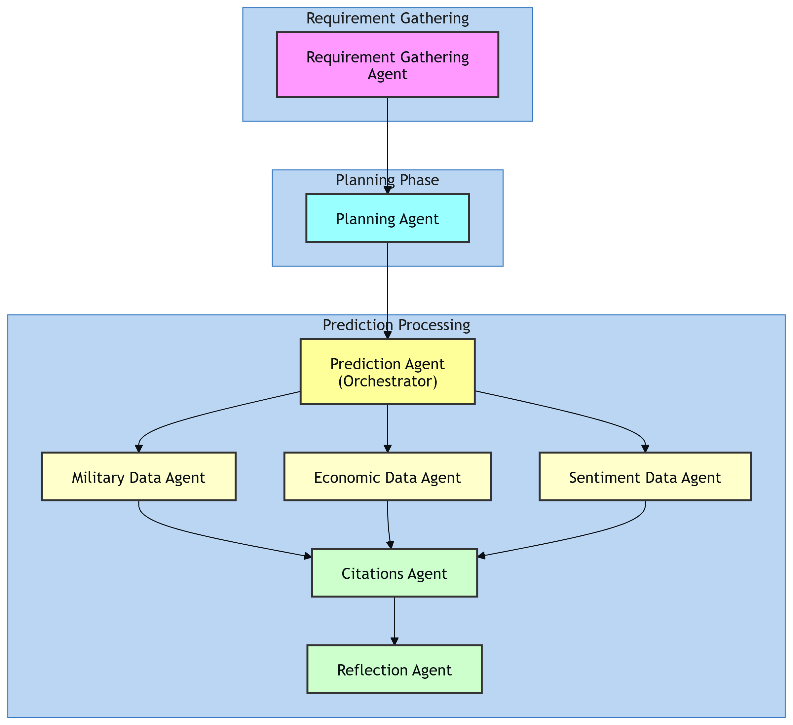

# ⚔️🌍⚔️ BattleLense – Conflict Prediction System

An **AI-driven multi-agent system** that predicts the possible outcome of a hypothetical conflict between two countries.  
It leverages **LLMs (OpenAI GPT + Google Gemini)**, **Tavily Search API**, and a custom **orchestration framework** to gather military, economic, and sentiment data, analyze contradictions, and provide a well-reasoned prediction report with citations.

---

## 🚀 Features

- **Multi-Agent Architecture**:
  - 📊 **Requirement Gathering Agent** – Collects countries for comparison.  
  - 🗺 **Planning Agent** – Generates a structured research plan.  
  - 🎯 **Prediction Agent (Orchestrator)** – Synthesizes results into conflict outcome probabilities.  
  - 🪖 **Military Data Agent** – Fetches and summarizes military strength.  
  - 💰 **Economic Data Agent** – Analyzes GDP, defense spending, and resilience.  
  - 📰 **Sentiment Data Agent** – Evaluates public morale, stability, and protests.  
  - 📚 **Citations Agent** – Compiles reliable sources for transparency.  
  - 🔎 **Reflection Agent** – Ensures logical consistency and balanced reasoning.  

- **Weighted Scoring Model**:  
  - Military Strength = **40%**  
  - Economy & Resources = **30%**  
  - Public Sentiment = **20%**  
  - Geography/Allies (qualitative) = **10%**  

- **Interactive CLI** – Users provide two countries, and the system outputs a structured prediction.

## 📊 System Diagram

[](diagram.png)

## 🎥 Video Demo

[](https://drive.google.com/file/d/1_OX3mBSMCwwmmpRght5PZyYnH4Pl1wLX/view?usp=drive_link)

---

## 📂 Project Structure

```
├── main.py                 # Orchestrator entrypoint
├── pyproject.toml          # Project configuration
├── diagram.png             # Project diagram
├── README.md               # Project documentation
├── requirements.txt        # Python dependencies
├── tools_agents.py         # Agent tools (Tavily search, Military, Economic, Sentiment, etc.)
└── uv/                     # UV package manager config
```

---

## 🔑 Requirements

- Python **3.9+**
- Dependencies:
  - `openai>=1.100.2`
  - `openai-agents>=0.2.8`
  - `python-dotenv>=1.1.1`
  - `ruff>=0.12.9`
  - `tavily-python>=0.7.11`

*(Dependencies are listed in `pyproject.toml`)*

---

## ⚙️ Setup

### 1. Clone the repository

```bash
git clone https://github.com/Waqas1o1/Battle-Lense.git
cd Battle-Lense
```

### 2. Install dependencies

```bash
pip install uv
uv pip install -r requirements.txt
```

### 3. Setup environment variables

Create a `.env` file in the project root:

```env
OPENAI_API_KEY=your_openai_key
OPENAI_API_KEY_2=your_secondary_openai_key
GEMINI_API_KEY=your_google_gemini_key
TAVILY_API_KEY=your_tavily_api_key
```

---

## ▶️ Usage

```bash
uv run main.py
```

### Example Interaction

**Option 1: Enter countries separately**
```
👋 Welcome! Which two countries do you want to compare?

You: IRAN  

Which other country would you like to compare with IRAN?  

You: PAKISTAN  
```

**Option 2: Enter both countries at once**
```
👋 Welcome! Which two countries do you want to compare?

You: PAKISTAN AND IRAN
```

### Sample Output

```
Prediction Agent
📊 Progress: 45.0% - Gathering military strength and weapons data...

Prediction Agent
📊 Progress: 60.0% - Collecting economic and resource information...

Prediction Agent
📊 Progress: 75.0% - Analyzing public opinion and morale...

Prediction Agent
📊 Progress: 82.0% - Checking consistency and refining reasoning...

Prediction Agent
📊 Progress: 92.0% - Compiling and verifying sources...

Final Prediction Report: Pakistan vs. Iran Conflict Outcome

🎯 Prediction

Pakistan: 52%
Iran: 48%

📋 Summary:
- Pakistan has stronger naval power and regional allies
- Iran has higher defense spending and resource advantage
- Public sentiment analysis shows mixed results on both sides

📚 Citations:
- [Global Firepower 2024](https://www.globalfirepower.com/)
- [World Bank GDP Data](https://data.worldbank.org/)
```

---

## 🤝 Contributing

Contributions are welcome! Please feel free to submit a Pull Request.

## ⚖️ Disclaimer

This tool is designed for educational and analytical purposes only. It should not be used to promote or encourage actual conflicts between nations.

## 📄 License

This project is licensed under the MIT License - see the [LICENSE](LICENSE) file for details.